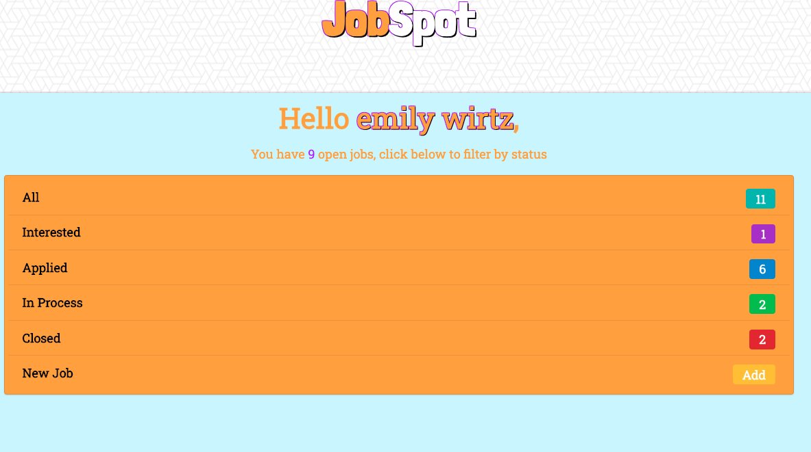

# JobSpot

## Table of Contents

- [About](#about)
- [Technologies](#technologies)
- [Installation](#installation)
- [App](#app)
- [Developer](#developer)
- [Questions](#Questions)

## About

The need for job hunting tools is greater than ever with unemployment rates being at an all time high. When searching for a job, it can be difficult to keep track of interview dates, names, phone numbers, addresses, job details and all other information associated with the job searching process. JobSpot provides a central location for its users to organize this information and compare job opportunities.

## Technologies

### Server Side

- Node
- MySQL
- Passport
- Bcryptjs
- Express-Sessions

### Client Side

- React
- Express
- Semantic UI
- React
- Axios

## Installation

To install necessary dependencies, run the following command in the root and client folders of this application

```
npm i
```

To run the program, run

```
npm start
```

To seed the database, run

```
npm run seed:up
```

## App



### View [Demo](https://job-spot.herokuapp.com/)

## Developers

      
 
   Mackenzie Schutz <a href="https://github.com/knzmck" target="_blank">@Knzmck</a>

      
 
   Emily Carlisle <a href="https://github.com/emcarlisle">@emcarlisle</a>  
 
      
  
   Emily Wirtz <a href="https://github.com/ewirtz3">@ewirtz3</a>
 
      
  
   Aleks Saiyan <a href="https://github.com/anverch">@Anverch</a>

## License

[](https://opensource.org/licenses/MIT)
